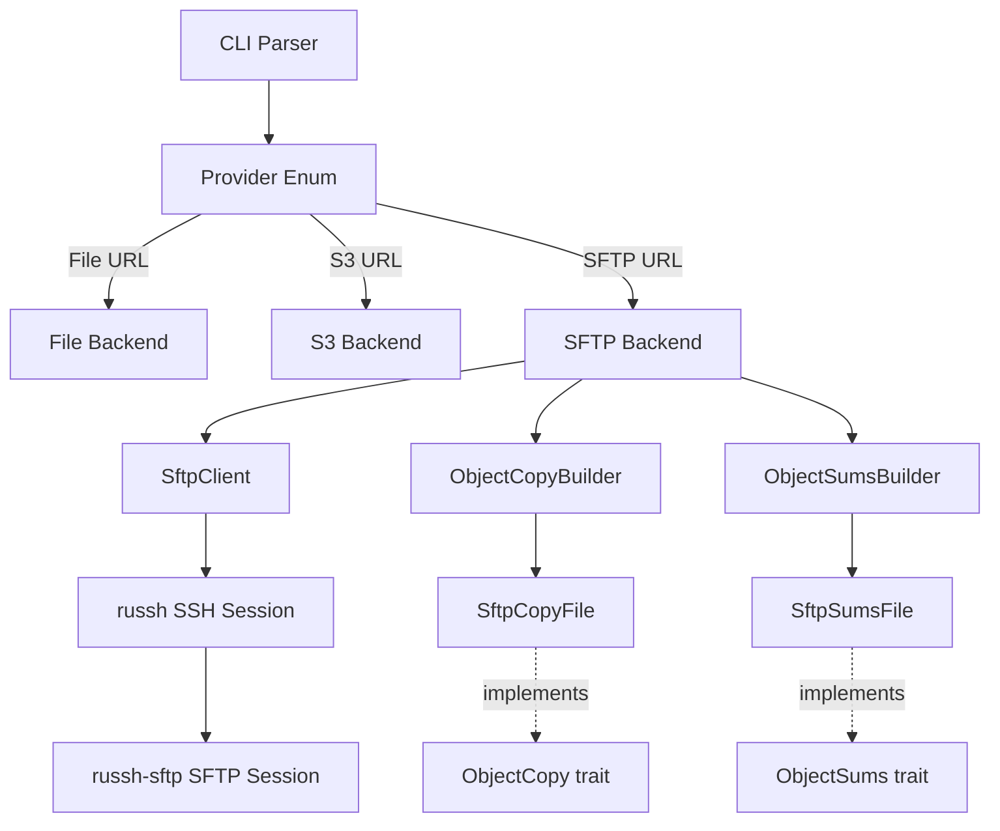
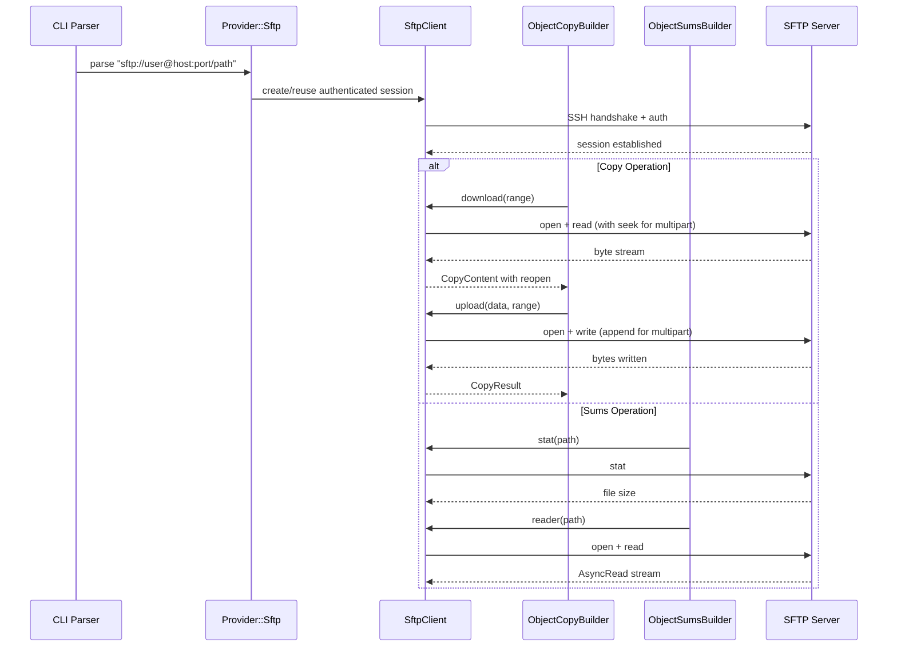

# Design Document: SFTP Support

## Overview

Add SFTP as a third provider backend to copyrite, enabling checksum generation, verification, and copy operations against SFTP servers. The implementation follows the existing dual-trait architecture (`ObjectCopy` + `ObjectSums`) and integrates with the `Provider` enum, URL parsing, and builder dispatch patterns already established by the File and S3 backends.

## Architecture

SFTP support is added as a third provider backend alongside the existing File and S3 backends. The architecture follows the established dual-trait pattern where `ObjectCopy` handles data transfer operations and `ObjectSums` handles checksum generation/verification. The new `SftpClient` wraps an async SSH/SFTP session (via `russh`) and is injected into both builder types through an optional field.



Key architectural decisions:
- **Pure Rust SSH stack**: Uses `russh` instead of libssh2 bindings for consistency with the async tokio runtime
- **Feature-gated**: SFTP support is behind a cargo feature flag (`sftp`) to keep the default binary lean
- **Session sharing**: `SftpClient` holds the session behind `Arc<Mutex<_>>` for safe concurrent access
- **No server-side copy**: SFTP lacks server-side copy, so cross-provider copies always go through download+upload

## Main Algorithm/Workflow



## Components and Interfaces

```rust
use std::path::PathBuf;
use std::sync::Arc;
use tokio::sync::Mutex;

/// New Provider variant for SFTP URLs.
#[derive(Debug, Clone)]
pub enum Provider {
    File { file: String },
    S3 { bucket: String, key: String },
    Sftp {
        /// Username for authentication.
        user: String,
        /// Remote hostname or IP.
        host: String,
        /// SSH port (defaults to 22).
        port: u16,
        /// Absolute remote path.
        path: String,
    },
}

/// Parsed SFTP connection parameters extracted from a URL.
#[derive(Debug, Clone, PartialEq, Eq, Hash)]
pub struct SftpEndpoint {
    pub user: String,
    pub host: String,
    pub port: u16,
}

/// Authentication method for SFTP connections.
#[derive(Debug, Clone)]
pub enum SftpAuth {
    /// Private key file path with optional passphrase.
    PrivateKey {
        key_path: PathBuf,
        passphrase: Option<String>,
    },
    /// Username/password authentication.
    Password { password: String },
}

/// A wrapper around an SFTP session providing async file operations.
/// Internally holds a shared, pooled SSH session.
#[derive(Clone)]
pub struct SftpClient {
    inner: Arc<Mutex<russh_sftp::client::SftpSession>>,
    endpoint: SftpEndpoint,
}

/// CLI arguments for SFTP configuration.
#[derive(Debug, Clone, clap::Args)]
pub struct SftpOptions {
    /// SSH private key path for SFTP authentication.
    #[arg(long, env = "COPYRITE_SFTP_KEY")]
    pub sftp_key: Option<PathBuf>,

    /// SSH key passphrase.
    #[arg(long, env = "COPYRITE_SFTP_PASSPHRASE")]
    pub sftp_passphrase: Option<String>,

    /// SSH password (if not using key-based auth).
    #[arg(long, env = "COPYRITE_SFTP_PASSWORD")]
    pub sftp_password: Option<String>,
}
```

## Data Models

### Provider::Sftp

The `Provider` enum gains a new `Sftp` variant holding the parsed URL components:

| Field | Type | Description | Validation |
|-------|------|-------------|------------|
| `user` | `String` | SSH username | Non-empty; defaults to OS username if omitted from URL |
| `host` | `String` | Remote hostname or IP | Non-empty; must be DNS-resolvable or valid IP |
| `port` | `u16` | SSH port | Defaults to 22; valid range 1–65535 |
| `path` | `String` | Absolute remote path | Must start with `/`; non-empty after host |

### SftpEndpoint

Connection identity used for session pooling/deduplication:

| Field | Type | Description |
|-------|------|-------------|
| `user` | `String` | SSH username |
| `host` | `String` | Remote hostname |
| `port` | `u16` | SSH port |

Implements `Hash` + `Eq` for use as a cache key.

### SftpAuth

Authentication method discriminant:

| Variant | Fields | Description |
|---------|--------|-------------|
| `PrivateKey` | `key_path: PathBuf`, `passphrase: Option<String>` | File-based key authentication |
| `Password` | `password: String` | Username/password authentication |

### SftpFileMetadata

Minimal file metadata returned by `stat`:

| Field | Type | Description |
|-------|------|-------------|
| `size` | `u64` | File size in bytes |
| `permissions` | `Option<u32>` | Unix permission bits (if available) |

### SftpOptions (CLI)

CLI arguments for SFTP configuration, sourced from flags or environment variables:

| Field | CLI Flag | Env Var | Description |
|-------|----------|---------|-------------|
| `sftp_key` | `--sftp-key` | `COPYRITE_SFTP_KEY` | SSH private key path |
| `sftp_passphrase` | `--sftp-passphrase` | `COPYRITE_SFTP_PASSPHRASE` | Key passphrase |
| `sftp_password` | `--sftp-password` | `COPYRITE_SFTP_PASSWORD` | SSH password |

## Key Functions with Formal Specifications

### Function 1: Provider::parse_sftp_url

```rust
impl Provider {
    /// Parse an SFTP URL in the format: sftp://[user@]host[:port]/path
    pub fn parse_sftp_url(s: &str) -> Result<Self> { ... }
}
```

**Preconditions:**
- `s` starts with `"sftp://"`
- `s` contains a non-empty host component
- `s` contains a non-empty absolute path component (after host:port)

**Postconditions:**
- Returns `Provider::Sftp` with valid fields
- `port` defaults to 22 if not specified
- `user` defaults to current OS username if not specified
- If host or path is empty, returns `ParseError`
- The path component is always absolute (starts with `/`)

**Loop Invariants:** N/A

---

### Function 2: SftpClient::connect

```rust
impl SftpClient {
    /// Establish an authenticated SFTP session to the remote endpoint.
    pub async fn connect(endpoint: &SftpEndpoint, auth: &SftpAuth) -> Result<Self> { ... }
}
```

**Preconditions:**
- `endpoint.host` is resolvable and reachable on `endpoint.port`
- `auth` contains valid credentials for the target host

**Postconditions:**
- Returns an `SftpClient` with an active, authenticated session
- On network/auth failure, returns a descriptive `CopyError` or `IOError`
- The underlying SSH session is held behind `Arc<Mutex<_>>` for safe sharing

**Loop Invariants:** N/A

---

### Function 3: SftpClient::read_range

```rust
impl SftpClient {
    /// Read a byte range from a remote file, returning an AsyncRead stream.
    /// If `start` and `end` are None, reads the entire file.
    pub async fn read_range(
        &self,
        path: &str,
        start: Option<u64>,
        end: Option<u64>,
    ) -> Result<Box<dyn AsyncRead + Send + Sync + Unpin>> { ... }
}
```

**Preconditions:**
- `path` is an absolute path to an existing remote file
- If specified, `start < end` and `end <= file_size`
- Session is connected and authenticated

**Postconditions:**
- Returns an `AsyncRead` positioned at `start` (or 0 if None)
- The stream yields exactly `end - start` bytes (or full file if both None)
- On remote IO error, returns `IOError`

**Loop Invariants:** N/A

---

### Function 4: SftpClient::write_file

```rust
impl SftpClient {
    /// Write data to a remote file. If `append` is true, appends to existing file.
    /// If `truncate` is true, truncates before writing.
    pub async fn write_file(
        &self,
        path: &str,
        data: &mut (dyn AsyncRead + Send + Unpin),
        offset: Option<u64>,
        truncate: bool,
    ) -> Result<u64> { ... }
}
```

**Preconditions:**
- `path` is a valid absolute remote path
- Parent directory of `path` exists on the remote
- Session is connected and authenticated

**Postconditions:**
- Returns number of bytes written
- If `truncate` is true, file is truncated before writing
- If `offset` is Some, writing begins at that offset (for multipart assembly)
- On remote IO or permission error, returns appropriate Error variant

**Loop Invariants:** N/A

---

### Function 5: SftpClient::stat

```rust
impl SftpClient {
    /// Get file metadata (size, permissions) from the remote.
    pub async fn stat(&self, path: &str) -> Result<SftpFileMetadata> { ... }
}

#[derive(Debug, Clone)]
pub struct SftpFileMetadata {
    pub size: u64,
    pub permissions: Option<u32>,
}
```

**Preconditions:**
- `path` is an absolute path on the remote server
- Session is connected and authenticated

**Postconditions:**
- Returns `SftpFileMetadata` with at least `size` populated
- If file does not exist, returns `IOError` (not found)

**Loop Invariants:** N/A

## Algorithmic Pseudocode

### SFTP ObjectCopy Implementation

```rust
/// SFTP implementation of the ObjectCopy trait.
#[derive(Clone)]
pub struct SftpCopyFile {
    client: SftpClient,
    source: Option<String>,
    destination: Option<String>,
}

#[async_trait::async_trait]
impl ObjectCopy for SftpCopyFile {
    async fn copy(
        &self,
        multipart: Option<MultiPartOptions>,
        _state: &CopyState,
    ) -> Result<CopyResult> {
        // SFTP has no server-side copy, so:
        // 1. For non-multipart: download then upload sequentially
        // 2. For multipart with part_number: no-op (handled by download/upload cycle)
        // 3. For multipart completion (part_number == None): no-op (file already assembled)
        match multipart {
            Some(ref mp) if mp.part_number.is_some() => Ok(CopyResult::default()),
            _ => {
                // Single-shot: download entire source, upload to destination
                let content = self.download(None).await?;
                let state = self.initialize_state().await?;
                self.upload(content, None, &state).await
            }
        }
    }

    async fn download(&self, multipart: Option<MultiPartOptions>) -> Result<CopyContent> {
        let source_path = self.get_source()?;

        let (start, end) = match &multipart {
            Some(mp) => (Some(mp.start), Some(mp.end)),
            None => (None, None),
        };

        let data = self.client.read_range(source_path, start, end).await?;

        // Build reopen factory for retry support
        let client_clone = self.client.clone();
        let source_clone = source_path.to_string();
        let mp_clone = multipart.clone();

        CopyContent::builder(data)
            .with_reopen(move || {
                let client = client_clone.clone();
                let source = source_clone.clone();
                let mp = mp_clone.clone();
                async move {
                    let (s, e) = match &mp {
                        Some(mp) => (Some(mp.start), Some(mp.end)),
                        None => (None, None),
                    };
                    let data = client.read_range(&source, s, e).await?;
                    CopyContent::builder(data)
                        .with_reopen(|| async { Ok(CopyContent::empty()) })
                        .build()
                }
            })
            .build()
    }

    async fn upload(
        &self,
        mut data: CopyContent,
        multipart: Option<MultiPartOptions>,
        _state: &CopyState,
    ) -> Result<CopyResult> {
        let dest_path = self.get_destination()?;

        let (offset, truncate) = match &multipart {
            Some(mp) => match mp.part_number {
                None => return Ok(CopyResult::default()), // Completion step
                Some(1) => (Some(mp.start), true),        // First part truncates
                Some(_) => (Some(mp.start), false),       // Subsequent parts append
            },
            None => (None, true), // Single upload truncates
        };

        let bytes = self
            .client
            .write_file(dest_path, &mut data.data, offset, truncate)
            .await?;

        CopyResult::new(None, None, bytes, vec![])
    }

    /// SFTP has no inherent multipart limits; use same approach as File backend.
    fn max_part_size(&self) -> u64 {
        u64::MAX
    }

    fn max_parts(&self) -> u64 {
        u64::MAX
    }

    fn min_part_size(&self) -> u64 {
        u64::MIN
    }

    async fn initialize_state(&self) -> Result<CopyState> {
        let source = self.get_source()?;
        let metadata = self.client.stat(source).await?;
        Ok(CopyState::new(metadata.size, None, None))
    }
}
```

### SFTP ObjectSums Implementation

```rust
/// SFTP implementation of the ObjectSums trait.
#[derive(Clone)]
pub struct SftpSumsFile {
    client: SftpClient,
    path: String,
}

#[async_trait::async_trait]
impl ObjectSums for SftpSumsFile {
    async fn sums_file(&mut self) -> Result<Option<SumsFile>> {
        let sums_path = SumsFile::format_sums_file(&self.path);

        // Check if sums file exists on remote
        match self.client.stat(&sums_path).await {
            Ok(_) => {
                // Read and parse existing sums file
                let mut reader = self.client.read_range(&sums_path, None, None).await?;
                let mut buf = Vec::new();
                reader.read_to_end(&mut buf).await?;
                let sums = SumsFile::read_from_slice(&buf).await?;
                Ok(Some(sums))
            }
            Err(_) => Ok(None), // File doesn't exist
        }
    }

    async fn reader(&mut self) -> Result<Box<dyn AsyncRead + Unpin + Send + 'static>> {
        let target_path = SumsFile::format_target_file(&self.path);
        let reader = self.client.read_range(&target_path, None, None).await?;
        Ok(reader)
    }

    async fn file_size(&mut self) -> Result<Option<u64>> {
        let target_path = SumsFile::format_target_file(&self.path);
        match self.client.stat(&target_path).await {
            Ok(metadata) => Ok(Some(metadata.size)),
            Err(_) => Ok(None),
        }
    }

    async fn write_sums_file(&self, sums_file: &SumsFile) -> Result<()> {
        let sums_path = SumsFile::format_sums_file(&self.path);
        let json = sums_file.to_json_string()?;
        let mut cursor = std::io::Cursor::new(json.into_bytes());
        self.client
            .write_file(&sums_path, &mut cursor, None, true)
            .await?;
        Ok(())
    }

    fn location(&self) -> String {
        Provider::format_sftp(&self.client.endpoint, &self.path)
    }

    fn api_errors(&self) -> HashSet<ApiError> {
        HashSet::new()
    }
}
```

### Provider Dispatch Updates

```rust
// In ObjectCopyBuilder::build()
impl ObjectCopyBuilder {
    pub async fn build(self) -> Result<Box<dyn ObjectCopy + Send + Sync>> {
        let provider_type = match (&self.source, &self.destination) {
            (Some(p), _) | (_, Some(p)) => p.provider_type(),
            _ => return Err(CopyError("No source or destination provided".to_string())),
        };

        match provider_type {
            ProviderType::S3 => { /* existing S3 logic */ }
            ProviderType::File => { /* existing File logic */ }
            ProviderType::Sftp => {
                let sftp_client = self.sftp_client.ok_or_else(|| {
                    CopyError("an SFTP client is required for SFTP providers".to_string())
                })?;
                let source = self.source.map(|p| p.into_sftp_path()).transpose()?;
                let destination = self.destination.map(|p| p.into_sftp_path()).transpose()?;

                let mut builder = SftpCopyBuilder::default().with_client(sftp_client);
                if let Some(path) = source {
                    builder = builder.with_source(&path);
                }
                if let Some(path) = destination {
                    builder = builder.with_destination(&path);
                }

                Ok(Box::new(builder.build()))
            }
        }
    }
}

// In ObjectSumsBuilder::build()
impl ObjectSumsBuilder {
    pub async fn build(self, url: String) -> Result<Box<dyn ObjectSums + Send>> {
        match Provider::try_from(url.as_str())? {
            Provider::File { file } => { /* existing */ }
            Provider::S3 { bucket, key } => { /* existing */ }
            Provider::Sftp { user, host, port, path } => {
                let sftp_client = self.sftp_client.ok_or_else(|| {
                    ParseError("an SFTP client is required for SFTP providers".to_string())
                })?;
                Ok(Box::new(SftpSumsFile {
                    client: sftp_client,
                    path,
                }))
            }
        }
    }
}
```

### URL Parsing Algorithm

```rust
impl Provider {
    /// Parse sftp://[user@]host[:port]/path
    pub fn parse_sftp_url(s: &str) -> Result<Self> {
        let Some(s) = s.strip_prefix("sftp://") else {
            return Err(ParseError(format!("{} is not an SFTP url", s)));
        };

        // Split user@host_port/path
        let (authority, path) = s.split_once('/')
            .ok_or_else(|| ParseError(format!("SFTP URL missing path: {}", s)))?;

        if path.is_empty() {
            return Err(ParseError("SFTP URL has empty path".to_string()));
        }

        // Parse user@host:port from authority
        let (user, host_port) = if let Some((u, hp)) = authority.rsplit_once('@') {
            (u.to_string(), hp)
        } else {
            (whoami::username(), authority)
        };

        let (host, port) = if let Some((h, p)) = host_port.rsplit_once(':') {
            let port = u16::from_str(p)
                .map_err(|_| ParseError(format!("invalid SFTP port: {}", p)))?;
            (h.to_string(), port)
        } else {
            (host_port.to_string(), 22)
        };

        if host.is_empty() {
            return Err(ParseError("SFTP URL has empty host".to_string()));
        }

        Ok(Self::Sftp {
            user,
            host,
            port,
            path: format!("/{}", path),
        })
    }

    /// Format an SFTP url for display.
    pub fn format_sftp(endpoint: &SftpEndpoint, path: &str) -> String {
        if endpoint.port == 22 {
            format!("sftp://{}@{}{}", endpoint.user, endpoint.host, path)
        } else {
            format!("sftp://{}@{}:{}{}", endpoint.user, endpoint.host, endpoint.port, path)
        }
    }

    /// Convert into SFTP path components.
    pub fn into_sftp_path(self) -> Result<String> {
        match self {
            Provider::Sftp { path, .. } => Ok(path),
            _ => Err(ParseError("not an SFTP provider".to_string())),
        }
    }

    /// Check if the provider is an SFTP provider.
    pub fn is_sftp(&self) -> bool {
        matches!(self, Provider::Sftp { .. })
    }

    /// Get the provider type for dispatch decisions.
    pub fn provider_type(&self) -> ProviderType {
        match self {
            Provider::File { .. } => ProviderType::File,
            Provider::S3 { .. } => ProviderType::S3,
            Provider::Sftp { .. } => ProviderType::Sftp,
        }
    }
}

/// Discriminant for provider dispatch without carrying data.
#[derive(Debug, Clone, Copy, PartialEq, Eq)]
pub enum ProviderType {
    File,
    S3,
    Sftp,
}

impl TryFrom<&str> for Provider {
    type Error = Error;

    fn try_from(url: &str) -> Result<Self> {
        if url.starts_with("s3://") {
            Self::parse_s3_url(url)
        } else if url.starts_with("sftp://") {
            Self::parse_sftp_url(url)
        } else {
            Ok(Self::parse_file_url(url))
        }
    }
}
```

### SftpClient Connection Algorithm

```rust
impl SftpClient {
    pub async fn connect(endpoint: &SftpEndpoint, auth: &SftpAuth) -> Result<Self> {
        use russh::client;
        use russh_keys::key;

        // 1. Build SSH client config
        let config = Arc::new(client::Config::default());

        // 2. TCP connect to host:port
        let addr = format!("{}:{}", endpoint.host, endpoint.port);
        let mut session = client::connect(config, &addr, Handler)
            .await
            .map_err(|e| CopyError(format!("SSH connection failed: {}", e)))?;

        // 3. Authenticate
        match auth {
            SftpAuth::PrivateKey { key_path, passphrase } => {
                let key = russh_keys::load_secret_key(key_path, passphrase.as_deref())
                    .map_err(|e| CopyError(format!("failed to load SSH key: {}", e)))?;
                if !session
                    .authenticate_publickey(&endpoint.user, Arc::new(key))
                    .await
                    .map_err(|e| CopyError(format!("SSH key auth failed: {}", e)))?
                {
                    return Err(CopyError("SSH key authentication rejected".to_string()));
                }
            }
            SftpAuth::Password { password } => {
                if !session
                    .authenticate_password(&endpoint.user, password)
                    .await
                    .map_err(|e| CopyError(format!("SSH password auth failed: {}", e)))?
                {
                    return Err(CopyError("SSH password authentication rejected".to_string()));
                }
            }
        }

        // 4. Open SFTP subsystem channel
        let channel = session.channel_open_session().await
            .map_err(|e| CopyError(format!("SSH channel open failed: {}", e)))?;
        channel.request_subsystem(true, "sftp").await
            .map_err(|e| CopyError(format!("SFTP subsystem request failed: {}", e)))?;

        let sftp = russh_sftp::client::SftpSession::new(channel.into_stream())
            .await
            .map_err(|e| CopyError(format!("SFTP session init failed: {}", e)))?;

        Ok(Self {
            inner: Arc::new(Mutex::new(sftp)),
            endpoint: endpoint.clone(),
        })
    }
}
```

## Example Usage

```rust
// Example 1: Parsing an SFTP URL
let provider = Provider::try_from("sftp://deploy@myserver.com:2222/data/files/report.csv")?;
assert!(provider.is_sftp());
// Provider::Sftp { user: "deploy", host: "myserver.com", port: 2222, path: "/data/files/report.csv" }

// Example 2: Copying from S3 to SFTP
let source_client = S3Client::new_from_cli_source(&credentials, &compatibility).await?;
let sftp_client = SftpClient::connect(&endpoint, &auth).await?;

let copy_task = CopyTaskBuilder::default()
    .with_source("s3://my-bucket/path/to/file.dat".to_string())
    .with_destination("sftp://user@host/remote/path/file.dat".to_string())
    .with_source_client(source_client)
    .with_sftp_client(sftp_client)
    .with_copy_mode(CopyMode::DownloadUpload)
    .build()
    .await?;

// Example 3: Generating checksums for a remote SFTP file
let sftp_client = SftpClient::connect(&endpoint, &auth).await?;
let sums_builder = ObjectSumsBuilder::default()
    .set_sftp_client(Some(sftp_client));
let mut sums_obj = sums_builder
    .build("sftp://user@host/remote/path/file.dat".to_string())
    .await?;
let size = sums_obj.file_size().await?;
let reader = sums_obj.reader().await?;

// Example 4: Using CLI
// copyrite generate sftp://user@server/path/to/file.bin --sftp-key ~/.ssh/id_ed25519
// copyrite copy s3://bucket/key sftp://user@server/dest/file.bin
// copyrite check sftp://user@server/a.bin sftp://user@server/b.bin
```

## Error Handling

### Error Mapping Strategy

SFTP errors are mapped into the existing `copyrite` error types to maintain consistency with the File and S3 backends:

| SFTP/SSH Error | Mapped To | Recovery |
|----------------|-----------|----------|
| DNS resolution failure | `CopyError("SSH connection failed: ...")` | Fail immediately with descriptive message |
| TCP connection refused/timeout | `CopyError("SSH connection failed: ...")` | Fail immediately; retry is caller's responsibility |
| SSH handshake failure | `CopyError("SSH connection failed: ...")` | Fail immediately |
| Authentication rejected | `CopyError("SSH [method] authentication rejected")` | Fail immediately; user must fix credentials |
| Private key load failure | `CopyError("failed to load SSH key: ...")` | Fail immediately; check path and passphrase |
| Remote file not found | `IOError` (not found) | Propagated to caller |
| Remote permission denied | `IOError` or `CopyError` | Propagated to caller |
| SFTP channel/session error | `CopyError("SFTP session init failed: ...")` | Fail immediately |
| URL parse failure | `ParseError(...)` | Fail immediately with format guidance |
| Read/write IO error | `IOError` | Propagated; multipart operations may retry via `reopen` |

### Authentication Method Selection

When SFTP authentication is needed, the CLI determines the method from the provided flags:
1. If `--sftp-key` is provided, use private key authentication (with optional `--sftp-passphrase`)
2. If `--sftp-password` is provided (and no `--sftp-key`), use password authentication
3. If neither is provided, fail with an error indicating that `--sftp-key` or `--sftp-password` must be specified

### Retry Semantics

- The `CopyContent` reopen factory enables the existing retry logic to re-read from SFTP on transient failures
- Session reconnection is NOT automatic — if the SSH session drops mid-transfer, the error propagates and the caller (task layer) handles retry at the operation level

## Testing Strategy

### Property-Based Testing Approach

**Property Test Library**: `proptest` (consistent with existing copyrite test infrastructure)

Key properties to verify with randomized inputs:
- **URL round-trip**: Generate arbitrary valid SFTP URL components, format → parse → assert equality
- **Multipart completeness**: Generate random file content and partition schemes, verify concatenation equals whole
- **Byte-range consistency**: For random offsets within file bounds, verify `read_range` returns exactly the expected byte count

### Unit Testing Approach

- **URL parsing**: Exhaustive cases for valid/invalid formats, edge cases (IPv6, special characters in paths, missing components)
- **Provider dispatch**: Verify all `ProviderType` variants are handled without panic in both builder types
- **Multipart limits**: Assert SFTP limits match File backend constants

### Integration Testing Approach

- Use a local SFTP server (e.g., `openssh` in a container or `russh` test server) for end-to-end tests
- Test scenarios:
  - Copy local file → SFTP destination → verify content match
  - Copy S3 → SFTP with multipart ranges
  - Generate checksums on SFTP-hosted file → verify against local computation
  - Authentication methods: key file, password
- Integration tests gated behind `#[cfg(feature = "sftp")]` and an environment flag to avoid CI overhead without an SFTP server

## Correctness Properties

*A property is a characteristic or behavior that should hold true across all valid executions of a system—essentially, a formal statement about what the system should do. Properties serve as the bridge between human-readable specifications and machine-verifiable correctness guarantees.*

### Property 1: URL round-trip parsing

*For any* valid SFTP Provider with a non-empty user, non-empty host, port in 1–65535, and an absolute path, formatting to a URL string and re-parsing SHALL produce an equivalent Provider::Sftp value with identical fields, and the path SHALL always start with `/`.

**Validates: Requirements 1.1, 1.4, 1.7, 1.8**

### Property 2: Multipart download completeness

*For any* file content and any valid set of contiguous, non-overlapping byte ranges that fully cover the file, concatenating the results of downloading each range SHALL produce content byte-identical to downloading the entire file without ranges.

**Validates: Requirements 4.1, 4.2**

### Property 3: Reopen produces identical bytes

*For any* download operation (with or without a byte range), calling the reopen factory on the returned CopyContent and reading the reopened stream SHALL yield byte-identical content to the original read.

**Validates: Requirements 4.3, 9.6**

### Property 4: Upload-download round-trip

*For any* byte content (single or multipart), uploading it to a remote path and then downloading from that same path SHALL yield byte-identical content to the original input.

**Validates: Requirements 4.4, 4.5, 4.6, 5.3**

### Property 5: File size accuracy

*For any* remote file, the size reported by `initialize_state` (via ObjectCopy) and by `file_size` (via ObjectSums) SHALL equal the actual file size as reported by the SFTP stat operation.

**Validates: Requirements 4.9, 5.4**

### Property 6: SumsFile serialization round-trip

*For any* valid SumsFile object, writing it to the remote via `write_sums_file` and then reading it back via `sums_file` SHALL produce an equivalent SumsFile object.

**Validates: Requirements 5.6, 5.1**

### Property 7: Location produces parseable SFTP URL

*For any* SftpSumsFile with a valid endpoint and path, the `location()` method SHALL return a string that successfully parses back into a Provider::Sftp value.

**Validates: Requirements 5.7, 1.1**

### Property 8: Builder dispatch exhaustiveness

*For any* valid ProviderType variant (File, S3, Sftp) with the appropriate client configured, both `ObjectCopyBuilder::build()` and `ObjectSumsBuilder::build()` SHALL return a valid trait object without panicking.

**Validates: Requirements 6.5, 6.6**

## Dependencies

### New Crate Dependencies

| Crate | Version | Purpose |
|-------|---------|---------|
| `russh` | `0.46` | Async SSH2 client (pure Rust, tokio-native) |
| `russh-sftp` | `2.1` | SFTP protocol on top of russh sessions |
| `russh-keys` | `0.46` | SSH key loading |
| `whoami` | `1` | Default username detection for URL parsing |

### Why russh over other options

- **Pure Rust**: No dependency on libssh2/OpenSSL C bindings
- **Async-native**: Built on tokio, consistent with copyrite's async runtime
- **Actively maintained**: Regular releases, security updates
- **Feature-complete**: Supports key auth, password auth, and the full SFTP protocol

### Feature Flag

The SFTP support should be gated behind a cargo feature flag to keep the default binary lean:

```toml
[features]
default = []
sftp = ["russh", "russh-sftp", "russh-keys", "whoami"]
```

This allows users who don't need SFTP to avoid pulling in the SSH stack.
